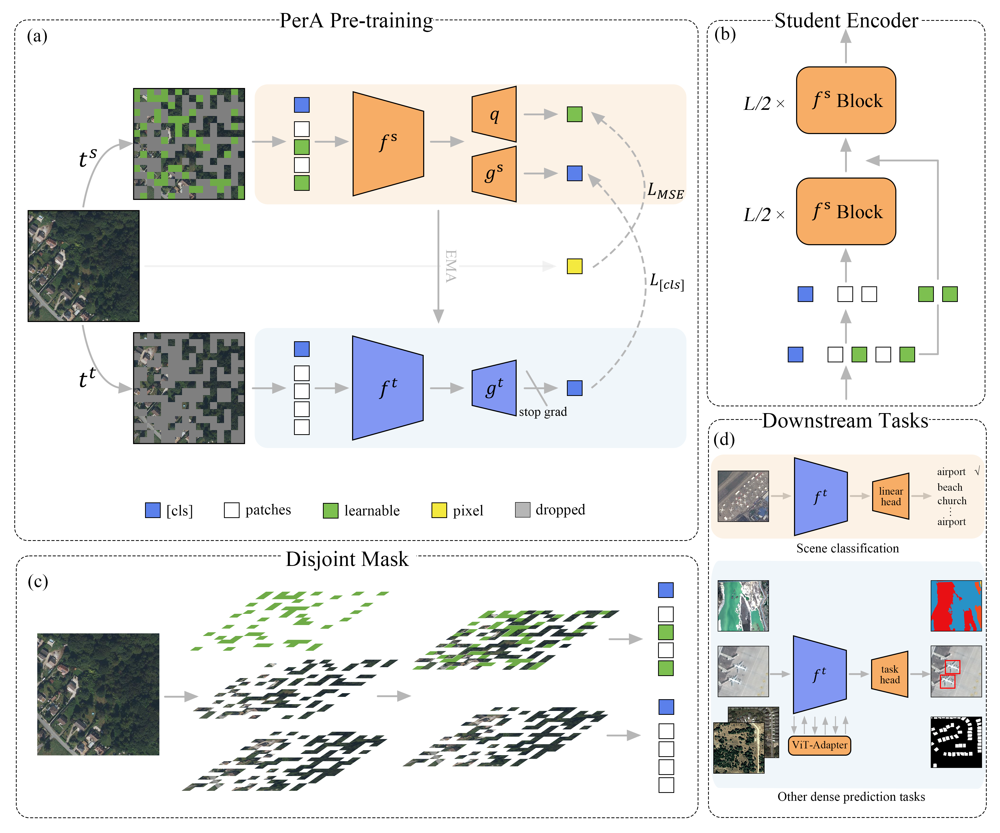

# PerA

## Introduction
This repository implements PerA pre-training, fine-tuning, distillation, among others. The architecture of PerA is shown below:


## 1. Clone the repository
```
git clone git@github.com:SathShen/PerA_dev.git
```

## 2. Install the required packages
Python 3.9 is required, only available for Linux. We test our code with Cuda 12.1.

Install dependencies:
```bash
pip install -r requirements.txt
```

## 3. Prepare the dataset
All pre-training data should be organized under a single folder. Images within all folders and subfolders will be automatically read.
The RSRSD-5m dataset can be downloaded from [here](https://github.com/SathShen/RSRSD-5m) (google drive link) or [here](https://drive.google.com/file/d/1-y5_y3_y9-y6-y6-y6-y6/view?usp=sharing) (Baidu Netdisk link).


## 4. Pre-train the model
The pre-trained ViT-G/16-1024 weights of PerA can be downloaded from [here](https://drive.google.com/file/d/1-y5_y3_y9-y6-y6-y6-y6/view?usp=sharing) (Google Drive link) or [here](https://pan.baidu.com/s/1-y5_y3_y9-y6-y6-y6-y6) (Baidu Netdisk link). 

Run in the terminal, please adjust the command as needed, please use the recommended config file located in the “Configs” folder to ensure the program runs properly.Pretrain you model using following command:
```bash
CUDA_VISIBLE_DEVICES=0,1 python -m torch.distributed.launch --nproc_per_node=8 --master_port 29999 pretrain.py -n pera -op output_path -pdp your_dataset -pp your_model.params -cfg your_config.yaml -cn your_note
```

If you want to resume the pretrain code from the checkpoint, add -r True like following command:
```bash
CUDA_VISIBLE_DEVICES=0,1 python -m torch.distributed.launch --nproc_per_node=8 --master_port 29999 pretrain.py -n pera -op output_path -pdp your_dataset -pp your_model.params -cfg your_config.yaml -r True -cn your_note
```